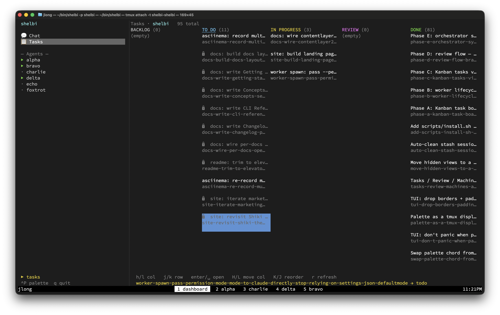

# Shelbi

```
   ▄▀▀▀▀▀▄   ▀▀    ▀▀  ▀▀▀▀▀▀▀   ▀▀   ▀▀▀▀▀▀▀▀▀▀▄   ▀▀▀▀▀
  ▀▀        ▀▀    ▀▀  ▀▀        ▀▀        ▀▀    ▀▀   ▀▀
  ▀▀▀▀▄    ▀▀▀▀▀▀▀▀  ▀▀▀▀▀▀    ▀▀      ▀▀▀▀▀▀▀▀▄    ▀▀
▄     ▀▀  ▀▀    ▀▀  ▀▀        ▀▀        ▀▀     ▀▀  ▀▀
 ▀▀▀▀▀▀  ▀▀    ▀▀  ▀▀▀▀▀▀▀▀  ▀▀▀▀▀▀▀▀  ▀▀▀▀▀▀▀▀  ▀▀▀▀▀
```

[](LICENSE)

> An open-source agent orchestrator for the terminal, built on tmux.

Shelbi lets you run, supervise, and review AI coding agents (Claude Code,
Codex, aider — anything with a CLI) in parallel across your laptop and on
remote machines. You talk to one **orchestrator agent**; it delegates work
to **worker agents** running in tmux panes — locally or over SSH — and
reports back. Jump into any worker's pane to watch live, and review/merge
diffs from a two-pane TUI. Part replacement-for-tmuxinator. Part
terminal-native Conductor. All you need on a worker machine is `tmux` and
your agent CLI.



## Learn more

The website and full documentation live at **<https://shelbi.dev>**:

- [Install](https://shelbi.dev/docs/getting-started/install) — prereqs,
  build from source, verify the binary.
- [Getting started](https://shelbi.dev/docs/getting-started/first-project)
  — first project, first task, the day-to-day loop.
- [Concepts](https://shelbi.dev/docs/concepts/workers) — workers, columns,
  events log, orchestrator.
- [CLI reference](https://shelbi.dev/docs/cli/task) — every subcommand
  and flag.

## Contributing

Bug reports and feature requests: <https://github.com/jlong/shelbi/issues>.
PRs welcome — see the [docs](https://shelbi.dev/docs) to get oriented,
then `cargo test --workspace` before opening one.

## License

MIT. See [LICENSE](LICENSE).
